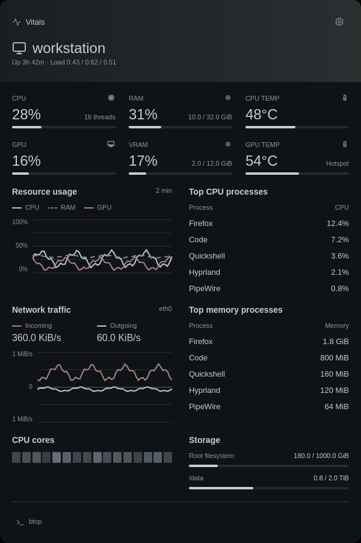

# Foamy Vitals

System activity and hardware readings.



## Install

Requires Omarchy Quattro, Bash, GNU coreutils, `jq`, and Python 3 for GPU
helpers. `btop` is optional.

```sh
omarchy plugin add https://github.com/foamrider/foamy-vitals.git --enable
```

## Use

- Left-click the widget to see usage, temperatures, processes, network traffic, and storage.
- Open the cog to change the bar reading, warning thresholds, and language.
- Click **btop** or right-click the widget to open btop (if installed).

Settings are saved in Omarchy's `shell.json`. Available readings depend on your hardware.

Intel (`i915`/`xe`) monitoring uses Python 3 and unprivileged DRM client counters.
GPU usage is the busiest engine, normalized for its engine count, across accessible
processes owned by the current user. The first sample has no usage reading.
GPU memory shows private allocations, excluding shared buffers to avoid counting
them twice; it is not total VRAM or resident memory. The lowest PCI-address Intel
GPU is selected when AMD/NVIDIA telemetry is not selected. On `i915`, the clock
shows the highest current GT frequency. Unexposed temperatures remain unavailable.
Collection shares the two-second cache and times out after 1.5 seconds.

NVIDIA GPUs using the proprietary driver are read through `nvidia-smi` and
Python 3 (standard library only). Install the NVIDIA driver utilities matching
your driver if `nvidia-smi` is missing. The lowest PCI-address NVIDIA GPU is used
when no sysfs GPU load source is available. Load, VRAM and temperature always
come from that same GPU. Thermal warnings use its reported shutdown threshold;
unsupported readings and limits remain unknown. Probes time out after 1.5 seconds
and share the normal two-second sample cache.

## Remove

```sh
omarchy plugin remove foamy.vitals
```

Removal stops metric collection. Cached readings and installed monitoring
tools remain on disk. Hardware and driver settings are not changed.

Omarchy manages the plugin entry in `shell.json`. Packages and data outside
the plugin directory are retained unless you remove them separately.

## License

Licensed under [MIT](LICENSE), with [Omarchy](LICENSE-OMARCHY) and
[Lucide](LICENSE-LUCIDE) notices.

Provided **as is**, without warranty or guaranteed support. Use at your own risk.
